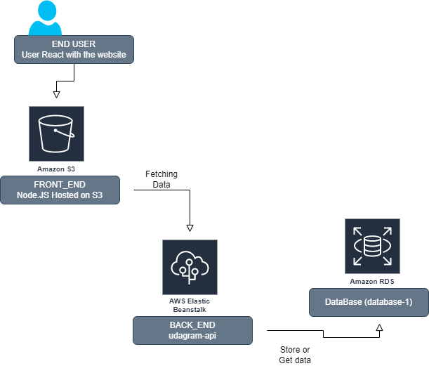

# Hosting a Full-Stack Application

## Infrastructure description

In this project we used some of AWS services :

- RDS PostgreSQL Services (DataBase Name is database-1)
- Elastic Beanstalk (appName is udagram-api and Environment name is udagram-api-dev)
- Two Amazon S3 bucket to store backend and front end files (udagrambucket01, elasticbeanstalk-us-west-2-029888997708) 
- IAM to create CLI User.

Note: s3 bucket's link of The front-end application is:
http://udagrambucket01.s3-website-us-west-2.amazonaws.com/

