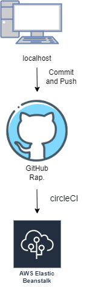

# Hosting a Full-Stack Application

## Pipeline process

### Build
1. install node and checkout code
    `npm run frontend:install`
    `npm run api:install`
2. Lint the frontend
    `npm run frontend:lint`

3. Build the frontend app
    `npm run frontend:build`

4. Build the backend API 
    `npm run api:build`

### Deploy
    `npm run deploy`

 .